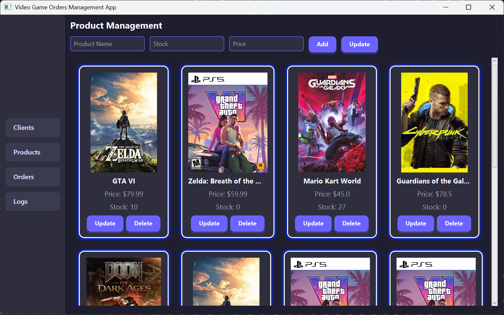
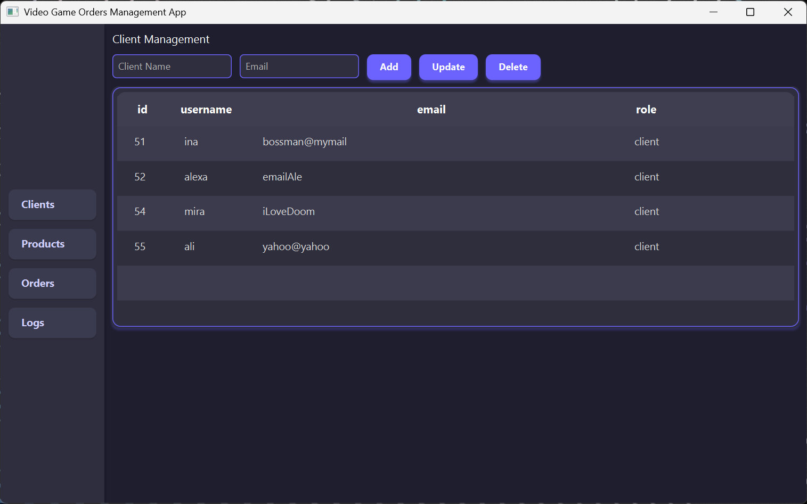
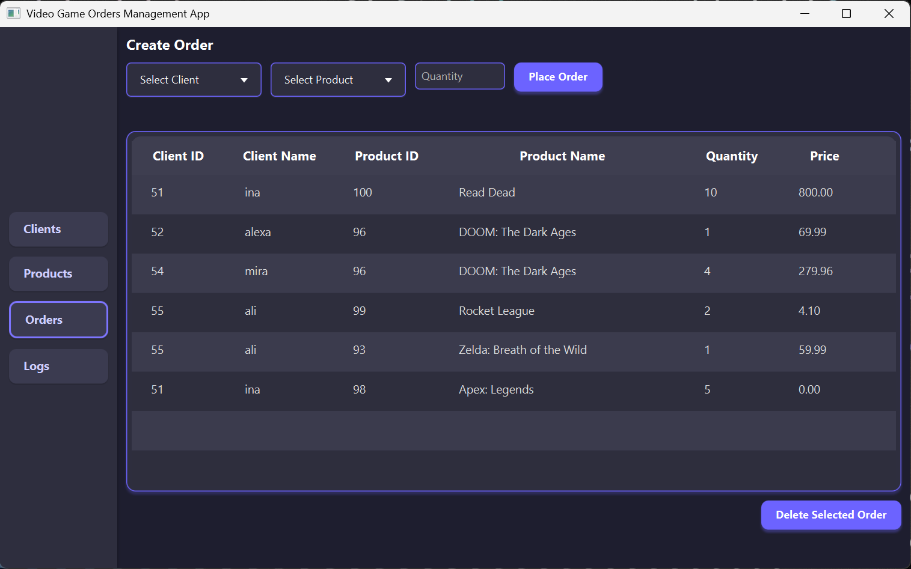
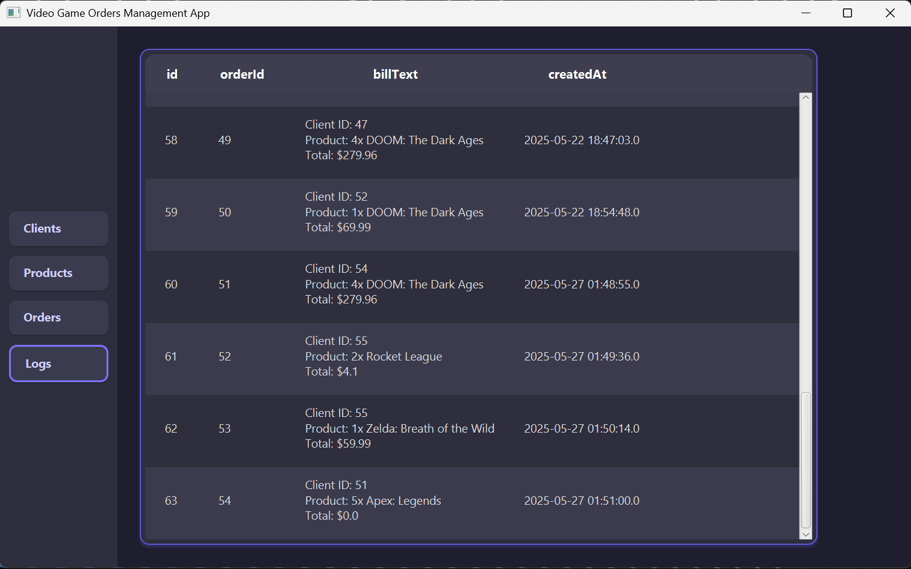

# Orders Management System

<div align="center">
  
  <p><em>Orders Management System Main Dashboard</em></p>
</div>

## 📋 Overview
The Orders Management System is a sophisticated Java-based warehouse management application that streamlines inventory control, order processing, and client management. Built with JavaFX and MySQL, it offers an intuitive and responsive interface for managing warehouse operations efficiently.

## ✨ Key Features

### 📦 Product Management

- Real-time inventory tracking
- Product CRUD operations
- Stock level monitoring
- Price management

### 👥 Client Management
<div align="center">
  
  <p><em>Efficient client information management</em></p>
</div>

- Client registration and profile management
- Role assignment
- Client history tracking

### 🛒 Order Processing
<div align="center">
  
  <p><em>Streamlined order management system</em></p>
</div>

- Intuitive order creation
- Automatic stock updates
- Real-time order tracking
- Order history

### 📄 Automated Billing
<div align="center">
  
  <p><em>Automated bill generation and management</em></p>
</div>

- Automatic bill generation
- Detailed billing history
- Transaction logging

## 🚀 Getting Started

### Prerequisites
- Java JDK 17 or higher
- MySQL 8.0 or higher
- Maven 3.6 or higher

### Installation

1. Clone the repository:
```bash
git clone [repository-url]
cd [folder-name]
```

2. Configure the database from the SQL Dump:
```sql
-- Create database
CREATE DATABASE warehouse_management;

-- Use the database
USE warehouse_management;
```

```bash
-- Import the provided SQL dump file into the database you just created
mysql -u your_username -p your_database_name < path/to/your_dump.sql
```

3. Update database configuration:
Edit `src/main/java/org/example/connection/ConnectionFactory.java` with your database credentials.

4. Build and run:
```bash
mvn clean install
mvn javafx:run
```

## 🗄️ Database Schema

```sql
CREATE TABLE Client (
    id INT PRIMARY KEY AUTO_INCREMENT,
    username VARCHAR(255) NOT NULL UNIQUE,
    email VARCHAR(255) NOT NULL,
    role VARCHAR(50) NOT NULL
);

CREATE TABLE Product (
    id INT PRIMARY KEY AUTO_INCREMENT,
    name VARCHAR(255) NOT NULL,
    quantity INT NOT NULL,
    price DECIMAL(10,2) NOT NULL
);

CREATE TABLE `Order` (
    id INT PRIMARY KEY AUTO_INCREMENT,
    client_id INT,
    product_id INT,
    quantity INT NOT NULL,
    timestamp TIMESTAMP DEFAULT CURRENT_TIMESTAMP,
    FOREIGN KEY (client_id) REFERENCES Client(id),
    FOREIGN KEY (product_id) REFERENCES Product(id)
);

CREATE TABLE Bill (
    id INT PRIMARY KEY AUTO_INCREMENT,
    orderId INT,
    billText TEXT NOT NULL,
    createdAt TIMESTAMP DEFAULT CURRENT_TIMESTAMP,
    FOREIGN KEY (orderId) REFERENCES `Order`(id)
);
```

## 🏗️ Project Structure

```
src/
├── main/
│   ├── java/
│   │   └── org/
│   │       └── example/
│   │           ├── model/           # Data models
│   │           ├── dataAccessLayer/ # Database operations
│   │           ├── bussinessLayer/  # Business logic
│   │           ├── presentation/    # UI components
│   │           └── connection/      # Database connectivity
│   └── resources/                  # Application resources
└── test/                          # Test cases
```

## 👥 User Capabilities
- Complete product management
- Client account management
- Order oversight
- System monitoring
- Report generation

## 🛠️ Technical Stack
- **Backend:** Java
- **Frontend:** JavaFX
- **Database:** MySQL
- **Build Tool:** Maven
- **Architecture:** Three-tier architecture with DAO pattern

## ✍️ Author
- **Staver Maxim** - Technical University of Cluj-Napoca
---